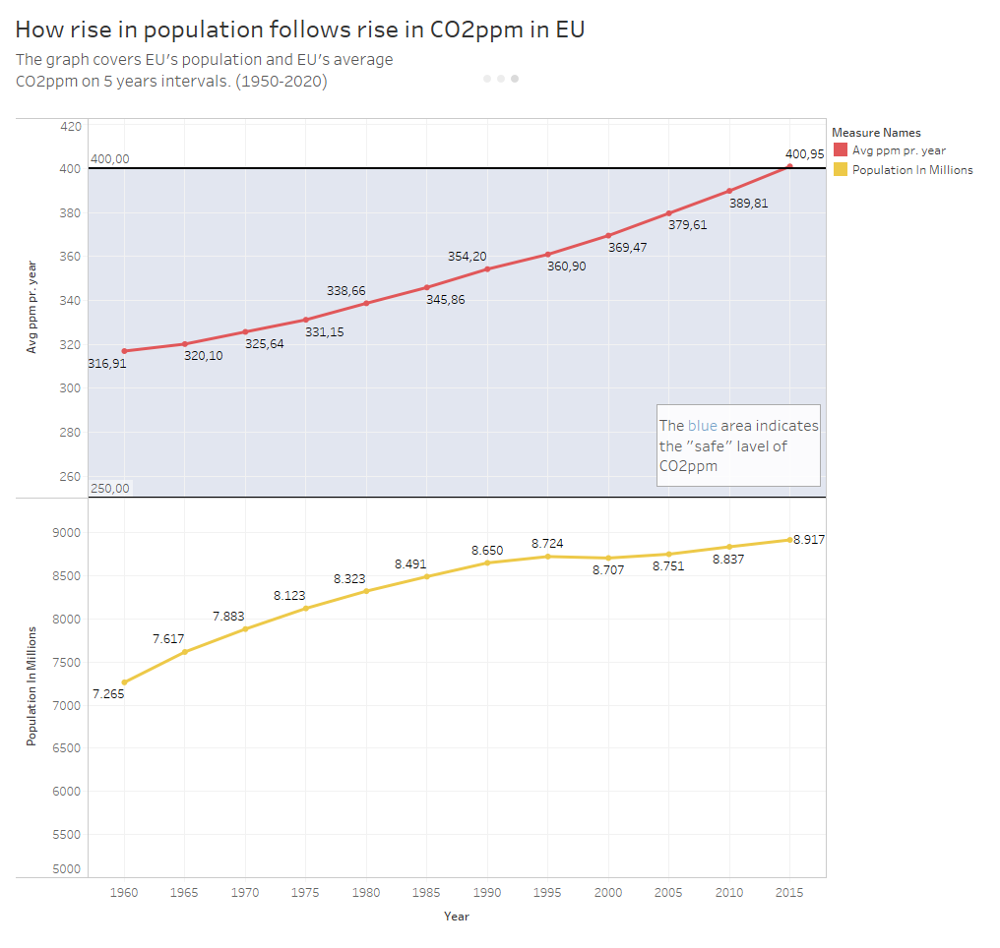
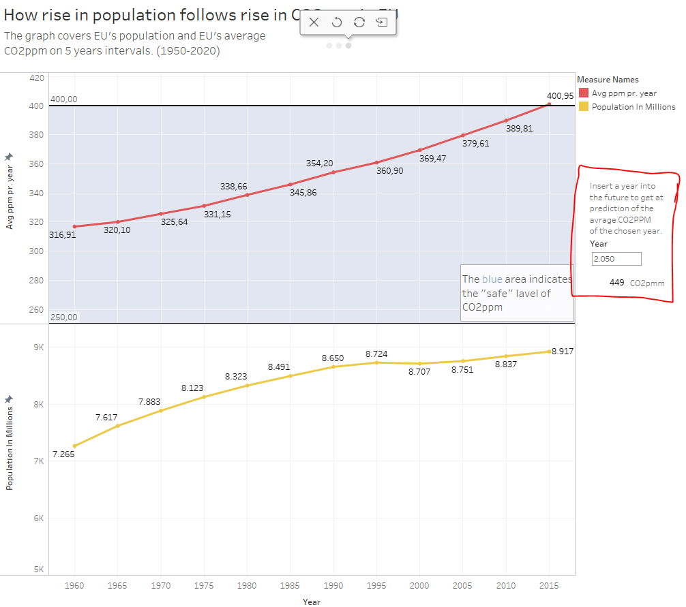
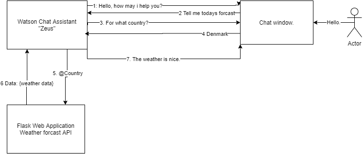
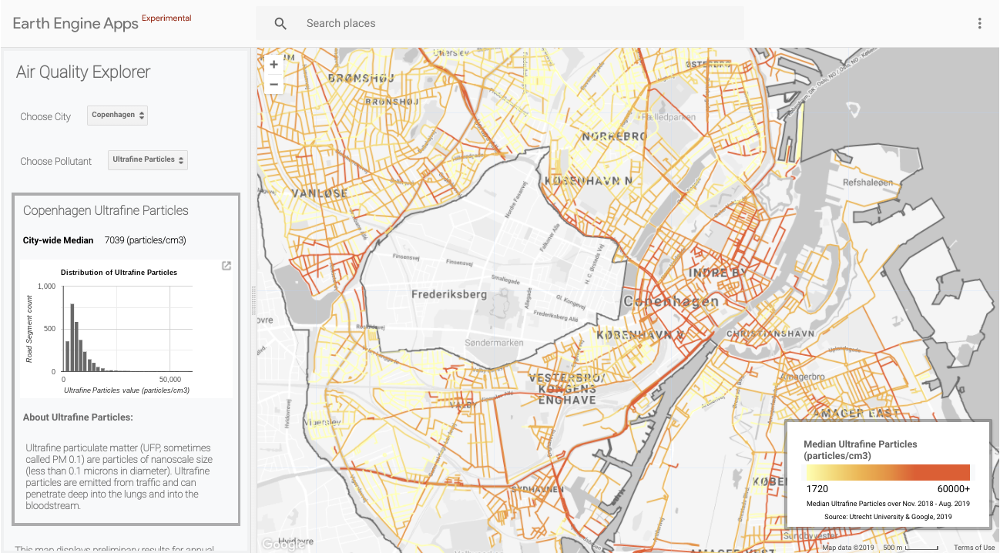
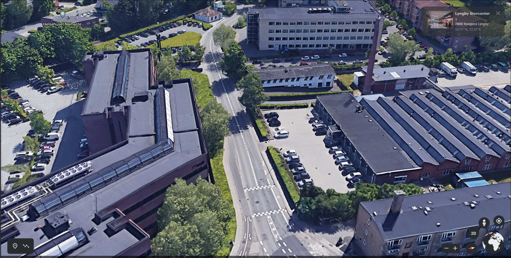
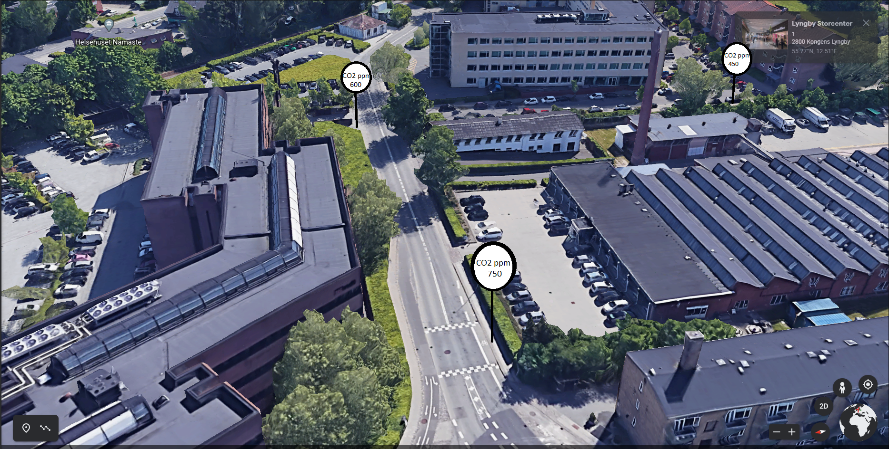
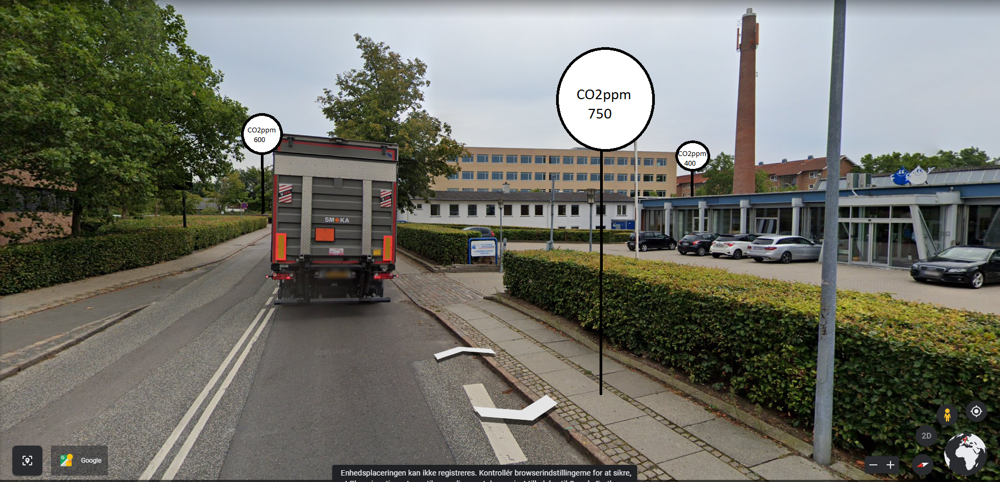
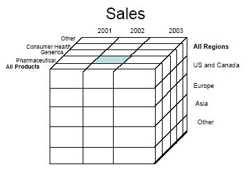

# Business Inteligence Examproject.

# ---------------STAGE 1-------------------

# Business Case Foundation

During the fires in the Amazon rainforest in 2019, 9,060 km2 of jungle was burned down in matter of months.

Even worse, the bushfires in Australia early 2020, burned down a wooping 186,000 km2 of wild area.

In both of these instances, people was spreading their fustration all over social medias that "Earths lungs was burning up" and that the worlds politican was doing too little to stop it. 

Our large green ecosystems are often assosiated with producing earths oxygen, and many belive that places like the Amazon rainforrest produces more than 30% of the oxygen in earths atmoshphere that we breath on a daily basis to survive. 

It is belived that the Amazonas fire was started and kept alive due to massive amount of deforestation, done by big companies and the government to increase their production and urbanization of the exposed land.

## However...
Some research seem to indicate, that the Amazon Rainforrest, while producing a lot of oxygen, reuses most, if not all, the oxygen it produces, to keep itself alive. 

So I have decided to gather some data, about defoestation, urbanization, population growth, money spend on envionmental/alternative energy research and the cleanliness of the air. To try and put som data to the claim. And to see if we as Human should worry about the damage we do our planet. Maybe technologies and money really is the right way to fix our problem. Or maybe leaving the forrests alone, is the more effective way. 

# The questions then becomes...

- Will deforestation increase air polution in the imidiate area.

- will urbanization increase air polution in the imidiate area.

- Will increasing the budget for green-tech companies and research reduce air polution.

- Will people in an area have effect on polution.

- When will we reach our breaking point for air polution (When will we run out of Oxygen)

- Is funding research worth the finacial cost VS being more mindfull.

## My hyptheses before my findings:

I am a firm believer in sience. And most sience suggest that we are on a sippery slope when it comes to earths healt and its ecosystmes. I strongly believe that the best way to fight global conesquenses is to be more mindfull of our green areas. But i also believe that we could balance a lot of it out with technologies. 

I expect my findings to back up this claim. That more people, more urbanization and more deforestation will result in a more poluted air. But as we see funding for research go up, we will see a small dip in the air polution. 

# ---------------STAGE 2-------------------
#  Business Data Storytelling
In Stage two I added a small story for the data, with a few images and graphs showing the evolution of the population in EU since, 1950 till 2020 and the evolution of CO2pmm in the same period. To see if there could be any sort of corrolation. 

My findings using the graphs shows that, during the boom in the 50's and 90's the population grew greatly. When we look closer at the two grahps we can see the soft curve of both follwoing each other in synch. 

The interresting information to gain from these graphs is, how the population slowly flatlines but the CO2pmm keeps its slope coefficient. 

# ---------------STAGE 3-------------------

# Integrating AI and Machine Learning

On stage 3 I wanted to add a small prediction model for the story. On the final page of the story, I have added a small input field, that accepts a "Year" parameter. It is connected to a notebook python project through tapby (running in an anaconda terminal).
all connected methods can be seen on localhost:9004.

When entering a Year, the field below will return the anwser with the expected CO2ppm for that year. 

Ex. Year 2050 will have CO2ppm of ~449ppm

The python code is available in the "Linear Calculation of CO2.ipynb" file.

## AI Watson appplication

For the AI module I aimed to add a Watson Chat assistant, that could access https://api-docs.iqair.com/ which is a public api that you can call for you local weather forcast and air pollution. The intend was to also connect it to my Machinelearning program, allowing people to ask Watson bout the predicted PPM for decired year - Which would have been nice to include in my project. 

Sadly I could not manage to connect my Flask web application with my Watson assistant. 

Watson is able to call external API's and return handled data as a chat respond for the user. 
The watson assisant "Zeue" Is created on IBM's cloud service https://eu-gb.assistant.watson.cloud.ibm.com .

The Flask application has been hosted on Heroku, https://weather-app-adj.herokuapp.com
You can get data on the paths /api/weather/denmark

Illustion of my Intent 

 
1. Watson greets the user.
2. The user starts a dialog with watson
3. Watson asks for Intent
4. The user provides watson with an awnser, and watson saves the slot.
5. Watson uses the data in it that slot to send a request to my webapplication
6. A string of data is returned to watson
7. Watson forwards the result as an awser to the user as a chat reply.

With more envoinmental data, a watson app could be purposed for users to figure out what their situation is like when it comes to pollution in their country or their local area. Should the concider more or less habits of CO2 emmssion. Could be a fast way to help people get a more approachble door into more green habits. 

# ---------------STAGE 4-------------------
# Immersive Analytics and Visualisation

For this particular subject - a fun idea for a visual data presentation could be in the form of Augmented Reality. 

The idea would be using something like googel maps, or bing maps, as the main visual aspect. Then with mapped data about air pollution of a very localized area. You could add small bubbles to the streeview image so people could get information about their air quality.

The google car, recently started recording this data while traveling the world recording street view, but only in a 2d fashion.

Adding a layer of augmented reality. You could create a more interactive presentation of the data, that makes it fun to explore what bubbles will show up where. Stuff like "Geoguesser" has become a big hit on the internet. It helps people learn about unfamiliar areas. This could help people educate themselves more about their local area. 

The next three images is a prototype of how such an Augmented reality implimentation could look.

The first Image is a stanard look from google maps. 

Second image is my imagination of the AR implimentaion to google earth.

How it would look in streetview.

it could also make be implimanted with Virtual Reality or overlayed in future tech, like the infermous google glasses. 

## Benefits of visualisation of data

### Better exploration:
- it is a lot easier to explore large data models with multiple dimensions in a 3D envionment. In a data model like the one below, you get the idea that the model has more dimensions to it, but with VR or other 3D visualization you would be able to get a better sense of all the "Data points" and not just those you can see in 2D
 

### Enriched Experience and satisfaction
As someone who enjoys playing around with data - it would be a lot more fun to be able to enteract with said data. In the proto type idea above - The satisfaction of walking out and exploring new data can be fun, and enrich the learning process. Not everyone finds a 2 dimensional graph that interresting. Human are vizual creatuers, the more we can see and experience the faster we learn and understand something.

### Easier modelling, simulation and testing
With more advance graphical options you can make a wide range of different moddels, and testing. But especially simulations has a lot to gain from more visual aspects. You also get a larger range of possibilities when it comes to moddeling your data in a precentable way.

### Creating extended worlds.
Lastly you can have some great fun, and make some great educational worlds. With fun and inovative ways to precent your data, and capture the readers attention. But with Simulation and data. In 3D supported engines you could simulate worlds, palnets and envionments for space travles as an exampel.  

